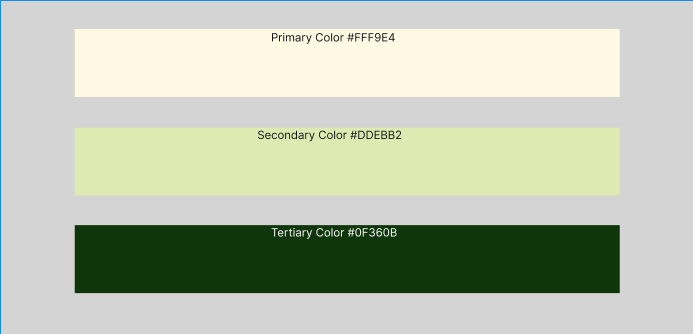
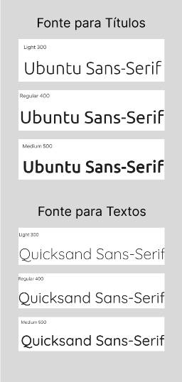
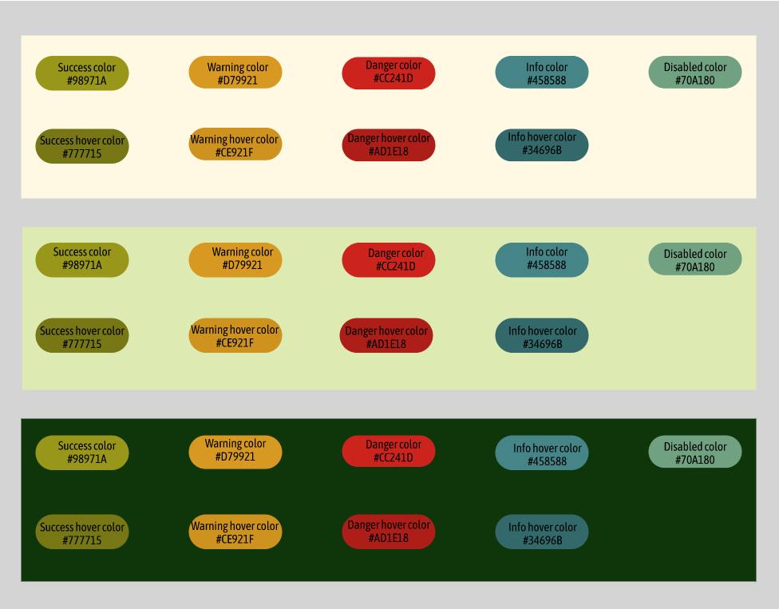
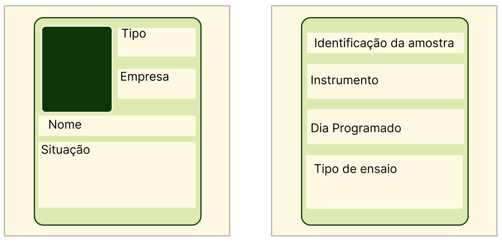

# Design System

Este documento define os padrões visuais e de interface do sistema para a utilização no projeto de gerenciamento de testes em EPI's para a FUNDACENTRO

# Paleta de Cores

## 📌 Cores principais

  Primary Color - #fff9e4

  Secondary Color - #ddebb2

  Tertiary Color - #0f360b

# 🔤 Tipografia

## 📌 Fonte para títulos
- Font-family: Ubuntu, sans-serif

## 📌 Fonte para textos
- Font-family: Quicksand, sans-serif

## 📌 Hierarquia

- H1: 32px / Bold
- H2: 24px / SemiBold
- H3: 20px / Medium
- Body: 16px / Regular
- Small: 14px / Regular

# 🧩 Componentes

## 🔘 Button

### Variações
- Success
- Warning
- Danger
- Info

### Estados
- Default
- Hover
- Disabled

## 📦 Card

### Uso
Container para agrupar informações.

# 📐 Espaçamento

## 📏 Escala de espaçamento

- 4px
- 8px
- 16px
- 24px
- 32px
- 48px

### 📌 Regra
Utilizar múltiplos de 8 para manter consistência visual.

# 📊 Grid

## 📌 Breakpoints

- Mobile: 320px
- Tablet: 768px
- Desktop: 1024px